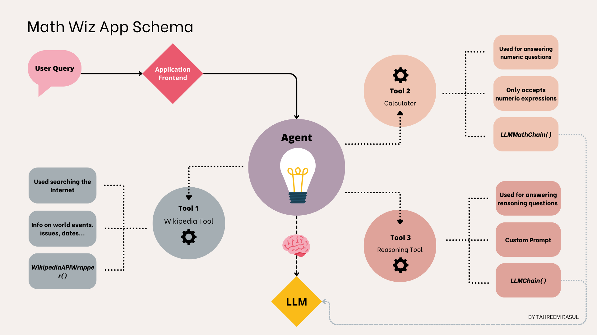
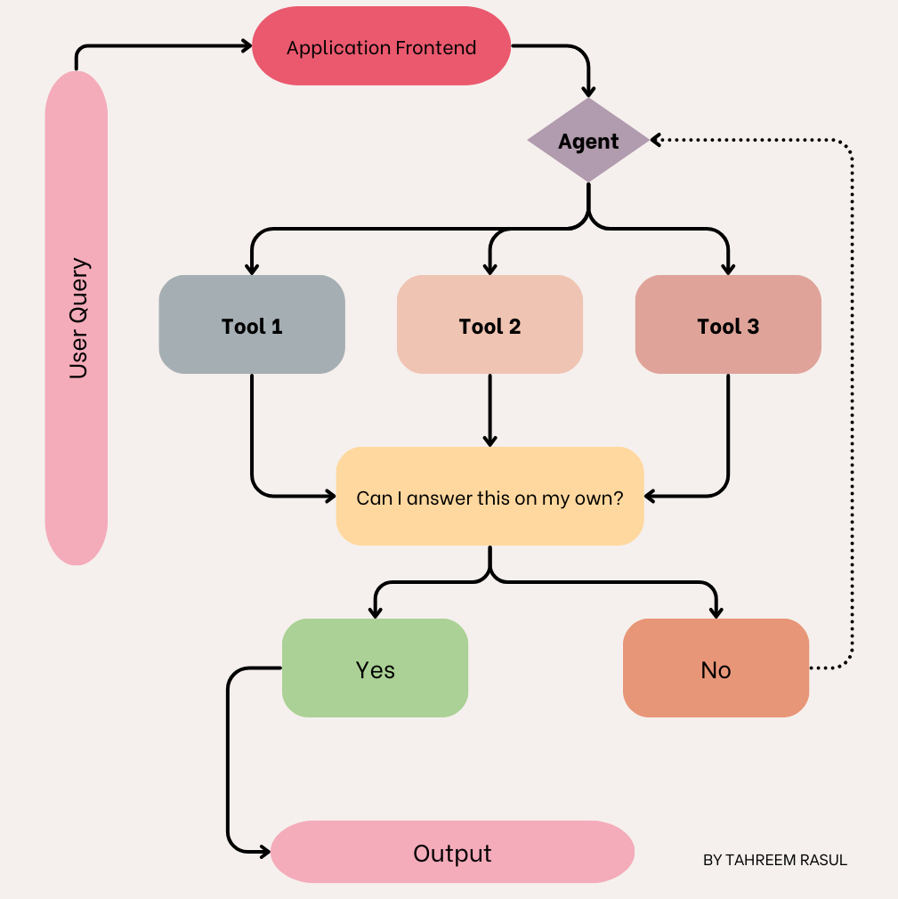

# Math App using LangChain Agents, OpenAI and Chainlit

You can read further [here in this medium article.](https://medium.com/@tahreemrasul/how-to-build-your-own-chatbot-with-langchain-and-openai-f092822b6ba6)

## Overview
This repo contains the code for a math app, Math Wiz, a custom chatbot that answers a user's arithmetic and reasoning questions. Chainlit is used for the web application portion.
LLMs can be quite bad at general math questions, even the simplistic ones. This can be due to a variety of reasons, such
as not having been trained on sufficient mathematical data, difficulty in carrying out numeric operations, as well as 
the fact that LLMs are text generators, and can struggle to come up with logic-based formulations. Having said that, they
do contain a large corpus of trained dataset, and can offer superior text understanding and generation qualities. In this 
tutorial, we will demonstrate how the use of LangChain agents can significantly increase an LLM's performance when working with 
numerical or reasoning-based questions.

## Application Process Diagram
LangChain Agents are comprised of one or more tools that can be used by the agent to get to the final decision. These 
tools can be online search, or chains  carrying out modular tasks in an application flow. Below is the process 
diagram for the app designed in this tutorial:


For each user query, the agent uses the LLM to decide which tool to use. The flow of the agent can be visualized with 
this flow diagram:


## Getting Started
### Prerequisites
- Python 3.8 or later
- An OpenAI API key

### Installation

1. **Clone the Repository**
   ```bash
   git clone git@github.com:tahreemrasul/simple_chatbot_langchain.git
   cd ./simple_chatbot_langchain
  
2. **Set Up a Conda Environment (Recommended)**
* If you don't have Conda, install it first.
* Create a new Conda environment:
   ```bash
   conda create -n math_assistant python=3.11
* Activate the environment:
   ```bash
   conda activate math_assistant

3. **Install Dependencies**
* Install the required packages using the `requirements.txt` file:
   ```bash
   pip install -r requirements.txt

4. **Set Up Your OpenAI API Key**
* Create a .env file in the root directory of the project.
* Add your OpenAI API key to the `.env` file:
   ```bash
   OPENAI_API_KEY='Your-OpenAI-API-Key-Here'

### Usage
To run the Math Wiz app, simply execute the `chatbot.py` script using:
   ```bash
   chainlit run chatbot.py -w --port 8000
```

This will run the application at  http://localhost:8000

